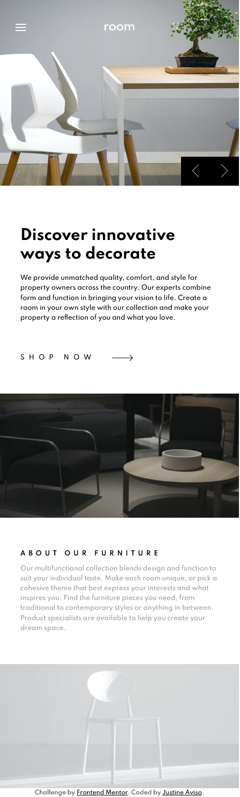

# Frontend Mentor - Room homepage solution

This is a solution to the [Room homepage challenge on Frontend Mentor](https://www.frontendmentor.io/challenges/room-homepage-BtdBY_ENq). Frontend Mentor challenges help you improve your coding skills by building realistic projects. 

## Table of contents

- [Overview](#overview)
  - [The challenge](#the-challenge)
  - [Screenshot](#screenshot)
  - [Links](#links)
- [My process](#my-process)
  - [Built with](#built-with)
  - [What I learned](#what-i-learned)
  - [Continued development](#continued-development)
- [Author](#author)

**Note: Delete this note and update the table of contents based on what sections you keep.**

## Overview

### The challenge

Users should be able to:

- View the optimal layout for the site depending on their device's screen size
- See hover states for all interactive elements on the page
- Navigate the slider using either their mouse/trackpad or keyboard

### Screenshot

### Links

- Solution URL: [Solutoin URL](https://www.frontendmentor.io/solutions/room-homepage-using-html-css-and-vanilla-javascript-00FmGh6q0)
- Live Site URL: [Live Website Url](https://room-homepage-frontendmentor.netlify.app/)

## My process

### Built with

- Semantic HTML5 markup
- CSS variables
- CSS logical functions
- Flexbox
- Mobile-first workflow

### What I learned

I've learn how to create a sliding carousel from scratch and css animations. And to not skip defining properties for each element before coding in order to have a better work flow.

### Continued development

I'ld like to focus on creating a cleaner and maintainable code in JS. To read the brief and look on design throughly before jumping into code
 
 
## Author

- Frontend Mentor - [@eta1389](https://www.frontendmentor.io/profile/eta1389)
- Facebook - [Justine Aviso](https://www.facebook.com/aviso.jstn)

